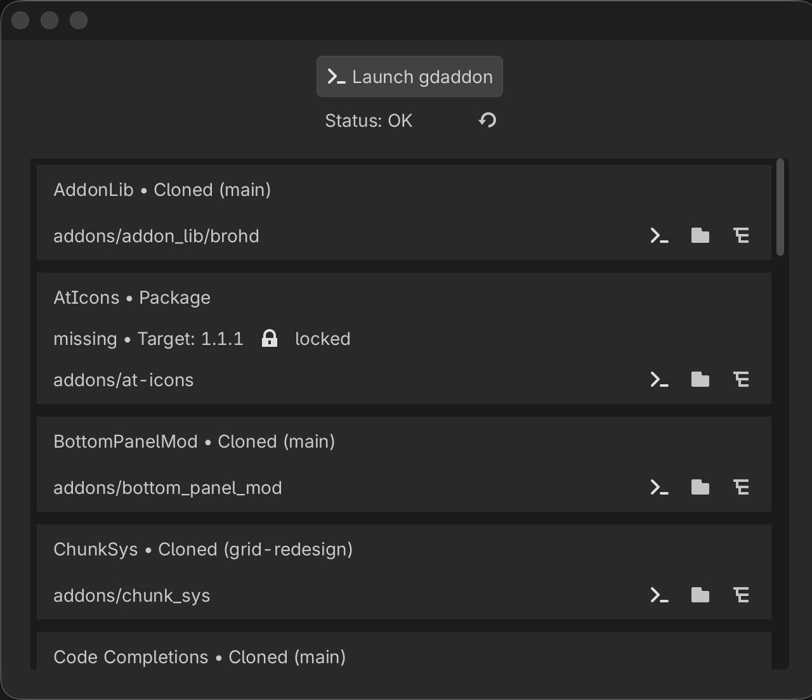

# gdaddon - Godot EditorPlugin

This is a GDScript wrapper for the gdaddon addon manager.



It provides:
 - Optional check for updates or missing depencies everytime you launch the editor.
 - Dialog window provides a quick look at the status of all plugins.
 - Launch gdaddon from the editor.
 - Quick navigation to each plugin. (terminal, native file system, godot file system)

This is intended as an easier launcher and doesn’t have access to all of the features of gdaddon.

## Requires the gdaddon binary

The plugin shells out to `gdaddon`, so install that first. It looks for `gdaddon` on your
PATH, then falls back to `~/.gdaddon/bin/gdaddon`:

```bash
# on PATH (~/.local/bin by default)
curl -fsSL https://raw.githubusercontent.com/brohd11/gdaddon/main/install.sh | sh

# or the no-PATH location this plugin falls back to
BIN_DIR="$HOME/.gdaddon/bin" curl -fsSL https://raw.githubusercontent.com/brohd11/gdaddon/main/install.sh | sh
```

Keep it current with `gdaddon update`. If the dialog reads `Status: gdaddon not found`,
neither location has a working binary.

This version needs a gdaddon with the subcommand CLI (`gdaddon list --json`); it won't
work with older binaries that used `gdaddon --list --json`.